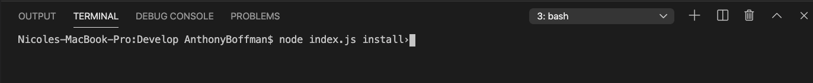
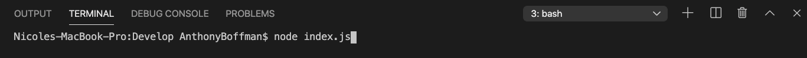
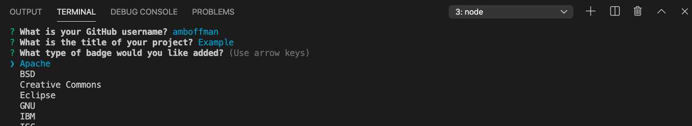
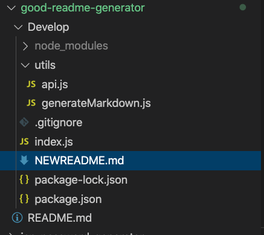

# Good README Generator
            
This application will guide you in creating a README.md file via node. Once you've provided all the necessary information, it will then create a formatted README file.
  
## Table of Contents
1. Installation
1. Usage
1. Questions
  
## Installation
To install all of the node modules used in this application, you must have node installed. Then in your terminal, type "node index.js install". This will install all of the dependent modules for you.

  
## Usage
First follow the installation process to install all of the modules needed to run this application. 
Once installation is complete, open the "Develop" folder in your terminal. When you run "node index.js" in the command line.

Then you will be prompted the following questions:
1. What is your GitHub username?
1. What is the title of your project?
1. What type of badge would you like added?
1. Describe your project.
1. What is the installation process?
1. How does someone use your project? 
1. What is the license for the project?
1. What are the guidelines for contributing?
1. What are examples of how you run tests?

Answer these questions about your GitHub and project. Don't worry if you mess any of them up, you can edit the final file. 

After the final question, you can find your new README under the filename "NEWREADME.md". Here you can edit your README to your heart's content. 

  
## Questions? Contact Me!

Email: amarrokalboffman@gmail.com
